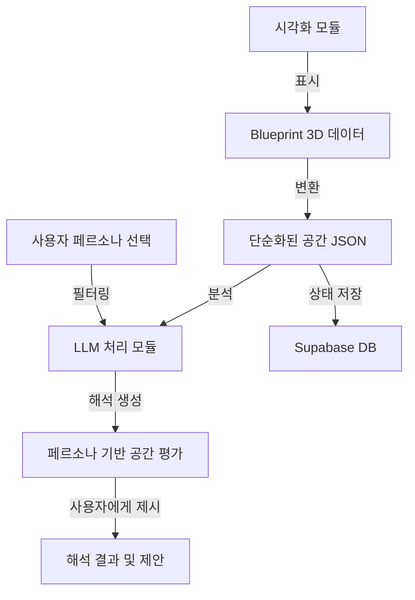

# 사용자 참여적 디자인을 지원하기 위한 대화 기반 시스템 프로토타입 개발


## 프로젝트 개요

이 프로젝트는 3D 평면도 데이터를 분석하고 자연어로 해석하는 LLM 기반 시스템입니다. 기존 Blueprint 공간 데이터를 단순화된 JSON으로 변환하여 각 공간의 특성(방 이름, 면적, 가구 배치 등)을 분석하고, 다양한 페르소나 관점에서 공간의 의미를 해석합니다. 시스템은 사용자에게 공간에 대한 통찰력을 제공하고 다음 디자인 단계를 자연어로 제안합니다.

## 주요 기능

- **공간 데이터 단순화**: 복잡한 벡터 데이터를 방별 구조화된 JSON으로 변환
- **관계적 공간 표현**: 가구 및 요소의 위치를 자연어 기반 관계 표현으로 서술
- **LLM 기반 공간 해석**: 각 방의 기능, 배치, 크기 등에 대한 자연어 분석
- **페르소나 기반 해석**: 다양한 사용자 유형(가족, 1인 가구, 노년층 등)의 관점에서 공간 평가
- **3D 시각화**: Three.js 기반 평면도 렌더링으로 공간 구조 직관적 파악
- **디자인 제안**: 공간 분석을 바탕으로 개선점 및 변경 사항 제안
- **프로젝트 저장**: 해석 결과 및 공간 데이터 저장 기능

## 구조적 특징

이 시스템은 **단방향 해석 구조**를 가집니다:
1. Blueprint 데이터가 단순화된 JSON으로 변환됨
2. LLM이 이 데이터를 분석하고 해석함
3. 사용자에게 해석 결과와 제안 사항을 제공함

시스템은 평면도를 직접 수정하지 않으며, 대신 공간에 대한 통찰력과 개선 방향을 제시합니다.

## 기술 스택

- **프론트엔드**: Next.js 14, React, TypeScript, TailwindCSS, shadcn/ui
- **3D 시각화**: Three.js
- **LLM 통합**: AI SDK, Claude/GPT API
- **데이터베이스**: Supabase
- **상태 관리**: React Context API

## 시스템 흐름도



## 데이터 구조 예시

```json
{
  "rooms": [
    {
      "name": "거실",
      "area": 24.5,
      "items": [
        {"name": "소파", "position": "창문과 마주보며 중앙에 위치", "relation": "TV와 마주봄"},
        {"name": "테이블", "position": "소파 앞에 위치", "relation": "동선의 중심"}
      ],
      "connections": ["주방과 개방적으로 연결됨", "현관에서 직접 접근 가능"],
      "features": ["남향 창문", "우드 플로어링", "간접 조명"]
    },
    {
      "name": "침실",
      "area": 16.2,
      "items": [
        {"name": "침대", "position": "창문과 수직으로 벽에 붙어 있음", "relation": "문에서 바로 보임"},
        {"name": "옷장", "position": "침대 맞은편 벽에 붙어 있음", "relation": "욕실 입구와 가까움"}
      ],
      "connections": ["복도를 통해 욕실과 연결됨"],
      "features": ["동향 창문", "카펫 바닥", "독서등"]
    }
  ],
  "metrics": {
    "total_area": 85.3,
    "room_count": 4,
    "public_private_ratio": 0.67,
    "entrance_openness_score": 0.75,
    "light_exposure": "오전 채광 우수",
    "space_efficiency": "중상"
  },
  "overall_character": "현대적 아파트 구조로, 공용 공간 중심의 소통형 가족 주거 환경"
}
```

## 해석 모듈 예시

시스템은 다음과 같은 측면에서 공간을 분석합니다:

- **기능적 분석**: 각 방의 용도와 활용성
- **동선 분석**: 공간 간 연결성과 이동 효율성
- **비율 분석**: 공적/사적 공간 비율, 공간 활용도
- **심미적 분석**: 조명, 개방감, 공간 배치의 조화
- **생활 패턴 분석**: 특정 페르소나에 맞는 공간 적합성

## 주요 파일 구조

```
src/
├── app/                    # 라우팅 및 API 엔드포인트
│   ├── (blueprint)/        # 평면도 시각화 페이지
│   ├── (chat)/             # 해석 결과 표시 인터페이스
│   └── api/                # 백엔드 API 엔드포인트
│
├── components/             # React 컴포넌트
│   ├── blueprint/          # 평면도 시각화 컴포넌트
│   ├── custom/             # 해석 결과 표시 컴포넌트
│   └── ui/                 # 공통 UI 컴포넌트
│
├── contexts/               # React Context API
│   └── BlueprintContext.tsx # 평면도 데이터 관리
│
├── lib/                    # 유틸리티 및 기능 모듈
│   ├── ai/                 # LLM 통합 관련 코드
│   ├── blueprint/          # 데이터 처리 및 변환 로직
│   │   ├── core/           # 핵심 데이터 구조
│   │   ├── items/          # 가구 및 요소 정의
│   │   ├── model/          # 데이터 모델
│   │   └── viewer3d/       # 3D 시각화 로직
│   │
│   └── supabase/           # Supabase 인터페이스
│
└── db/                     # 데이터베이스 관련 코드
```

## 설치 및 실행 방법

```bash
# 저장소 클론
git clone https://github.com/your-username/space-interpreter.git
cd space-interpreter

# 의존성 설치
npm install

# 개발 서버 실행
npm run dev

# 빌드
npm run build

# 프로덕션 서버 실행
npm start
```

## 환경 변수 설정

`.env.local` 파일을 생성하고 다음 환경변수를 설정하세요:

```
NEXT_PUBLIC_SUPABASE_URL=your_supabase_url
NEXT_PUBLIC_SUPABASE_ANON_KEY=your_supabase_anon_key
OPENAI_API_KEY=your_openai_api_key
ANTHROPIC_API_KEY=your_anthropic_api_key
```

## 사용 예시

다음은 시스템이 공간을 해석하는 예시입니다:

**입력 데이터**: 2개의 침실, 거실, 주방이 있는 아파트 평면도 JSON

**해석 결과**:
```
이 공간은 총 85.3m²의 아파트로, 4개의 방으로 구성되어 있습니다. 
거실(24.5m²)에는 소파가 창문과 마주보며 중앙에 위치하고 있어 자연광을 충분히 활용하는 
배치입니다. 테이블은 소파 앞에 위치하여 동선의 중심이 되고 있습니다.

거실은 주방과 개방적으로 연결되어 식사 공간과 휴식 공간의 경계가 자연스럽게 
어우러지며, 현관에서 직접 접근 가능하여 방문객 응대에 편리합니다.

공적 공간(거실, 주방)과 사적 공간(침실, 욕실)의 비율이 0.67로, 
균형 잡힌 생활 패턴을 지원합니다. 특히 오전 채광이 우수하여 
아침 활동에 긍정적인 영향을 줄 것으로 보입니다.

개선 제안:
1. 침실의 침대 위치를 창문과 평행하게 재배치하면 수면 환경이 개선될 수 있습니다.
2. 주방 공간에 아일랜드 선반 추가를 고려하여 작업 공간을 확장하는 것이 좋겠습니다.
3. 현관 쪽 신발장을 재배치하면 개방감이 더 향상될 수 있습니다.
```

## 페르소나 기반 해석 예시

**페르소나**: 노년층 거주자

```
이 공간은 노년층 거주자에게 몇 가지 고려사항이 필요합니다.
침실에 침대가 창문과 수직으로 벽에 붙어 있어 이동 공간이 확보되어 있으나,
침대 높이 조정과 측면에 안전 손잡이 추가가 필요합니다.

거실의 소파가 창문과 마주보는 배치는 채광 면에서 좋으나, 
저녁 시간 눈부심을 방지하기 위한 블라인드 설치를 권장합니다.
또한 소파와 테이블 사이 거리가 동선의 중심이 되므로, 
이 공간에 미끄럼 방지 처리가 필요합니다.

현관에서 거실로 직접 접근 가능한 구조는 이동 편의성을 높이지만,
현관 단차 제거와 신발장 높이 조정이 필요합니다.
또한 모든 방 입구 폭이 휠체어나 보행기 사용에 충분한지 확인해야 합니다.
```

## 향후 개발 계획

- 더 다양한 페르소나 프로필 추가
- 시간대별 공간 활용 분석 기능
- 에너지 효율성 및 지속가능성 분석
- AR/VR 통합을 통한 해석 결과 시각화
- 커뮤니티 기반 공간 평가 시스템

## 라이선스

이 프로젝트는 MIT 라이선스 하에 배포됩니다. 자세한 내용은 LICENSE 파일을 참조하세요.

## 연락처 및 피드백

프로젝트에 대한 질문이나 피드백이 있으시면 이슈를 생성하거나 다음 연락처로 문의해주세요:
- 이메일: your-email@example.com
- 웹사이트: https://your-website.com

---

*이 프로젝트는 주거 공간을 단순히 물리적 구조가 아닌 삶의 맥락에서 해석하고, 다양한 관점에서 공간의 의미를 이해하는 데 초점을 맞추고 있습니다.*
